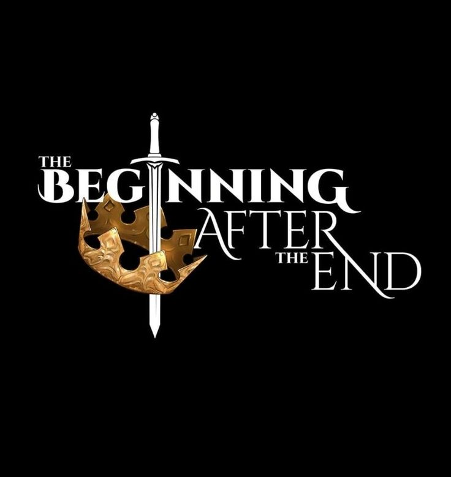

# WD-Seatwork-2


<p>
  
</p>

**Short Description:**  
A multi-page web project featuring characters from *The Beginning After the End*, with added creativity, transitions, and animation to make each page unique.

---

## 📘 Overview

This is a multi-page HTML and CSS website created for a Web Development seatwork. It is a creative, character-themed project that features transitions, styled backgrounds, and interactive elements such as navigation bars and hover effects. The main goal is to practice HTML and CSS while showcasing design creativity and layout structure. Built entirely with HTML5 and CSS3, the site uses no JavaScript frameworks and is statically deployed using GitHub Pages.

---

## 🧩 Key Components

- Multi-Page Website
- Animated transitions and creative layout
- Character-centric design
- Hover effects and styled backgrounds

---

## 🛠️ Technology


---

## 🗂️ File Structure

```plaintext

WD-SEATWORK-2/
│
├── .github/
│   └── workflows/
│       └── static.yml
│
├── assets/
│   ├── img/
│   │   ├── art.jpeg
│   │   ├── art2.jpeg
│   │   ├── bg.webp
│   │   ├── elijah.jpeg
│   │   ├── gideon.jpeg
│   │   ├── home.jpeg
│   │   ├── home2.jpeg
│   │   ├── rd.jpeg
│   │   ├── Roronoa Zoro wallpaper.jpeg
│   │   ├── Sylvie.jpeg
│   │   └── tess.jpeg
│   └── style.css
│
├── pages/
│   ├── page1/
│   │   ├── img/
│   │   │   ├── 1.jpeg to 6.jpeg
│   │   │   ├── Arthur Leywin.jpeg
│   │   │   └── artpg1.jpg
│   │   └── index.html
│   │
│   ├── page2/
│   │   ├── img/
│   │   │   ├── t1.jpeg to t5.jpeg
│   │   │   ├── tess.jpeg
│   │   │   ├── tessbg.jpeg
│   │   │   └── tessiabg.jpeg
│   │   └── index.html
│   │
│   ├── page3/
│   │   ├── img/
│   │   │   ├── eli.jpeg
│   │   │   ├── eli2.jpeg
│   │   │   ├── eli3 (1).jpeg
│   │   │   ├── eli4.jpeg
│   │   │   └── elijah.jpeg
│   │   └── index.html
│   │
│   ├── page4/
│   │   ├── img/
│   │   │   ├── 1sylv (1).jpeg to 1sylv (7).jpeg
│   │   │   └── sylviebg.jpeg
│   │   └── index.html
│   │
│   └── page5/
│       ├── img/
│       │   ├── download (7).jpeg
│       │   ├── zoro1.jpeg to zoro4.jpeg
│       │   └── zorobg.jpeg
│       └── index.html
│
├── .gitattributes
├── index.html
└── README.md


---

| Resource Type | Description                     | Link                                       |
| ------------- | ------------------------------- | ------------------------------------------ |
| Photos        | Character and background images | [Pinterest](https://www.pinterest.com)     |
| Photos        | General image search and assets | [Google Images](https://images.google.com) |

